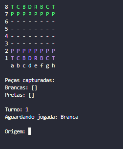

# ♟️Projeto Xadrez

Aplicação de console desenvolvida em C# que permite jogar uma partida completa de xadrez diretamente no terminal, incluindo movimentos válidos, lógica das peças e controle do estado da partida. 

## ▶️ Como Jogar
1. Acesse o repositório no GitHub.

2. No canto superior direito, clique no botão Fork.

3. O GitHub criará uma cópia do projeto no seu perfil.

4. Entre no repositório que foi criado no seu perfil.

5. Clique no botão verde Code.

6. Copie o link HTTPS (exemplo: https://github.com/seu-usuario/projeto-xadrez.git).

7. Abra seu terminal e execute:
git clone https://github.com/seu-usuario/projeto-xadrez.git
cd projeto-xadrez

8. Abra sua IDE e execute: dotnet run

## 🖼️ Exemplo do Tabuleiro

Visualização inicial do tabuleiro no terminal:

## 📄 Licença

Projeto completamente dirigido pelo curso de C# do professor Nelio alves.

